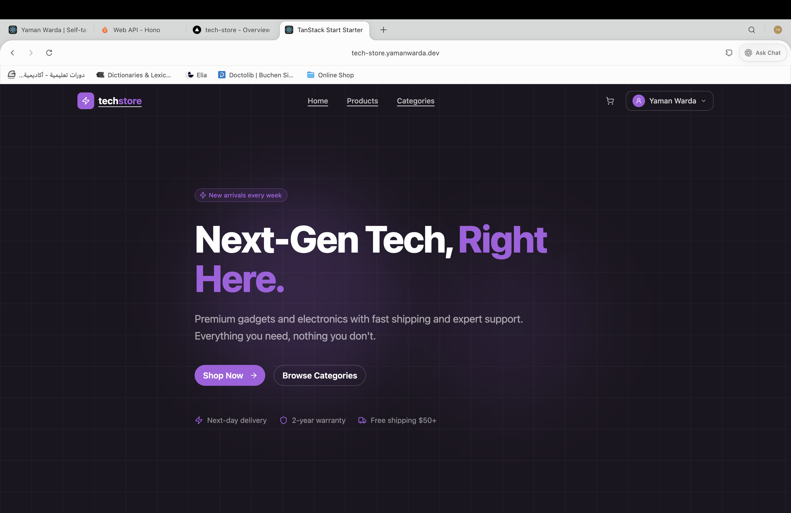
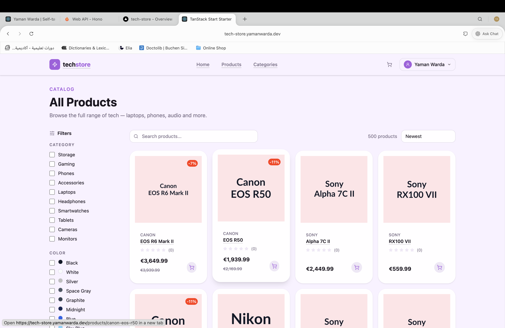
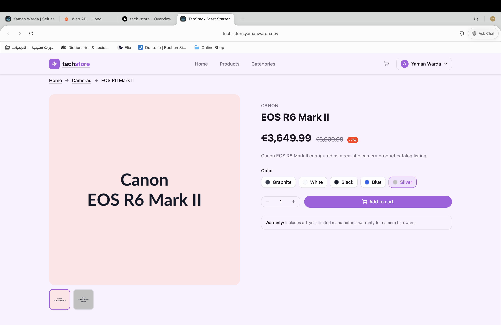
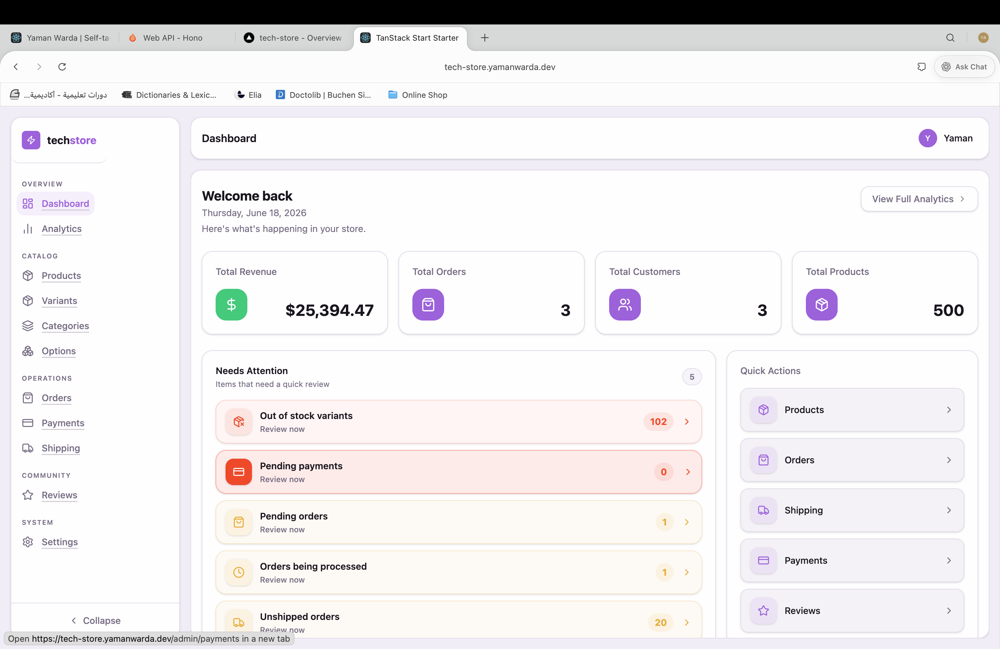

# Tech Store

A full-stack e-commerce application for tech & electronics — built from scratch with a modern React stack, real payments, authentication, and a complete admin dashboard.

### 🔗 [Live Demo → tech-store.yamanwarda.dev](https://tech-store.yamanwarda.dev)

**Try it instantly — demo account (includes admin access):**

| Email | Password |
| --- | --- |
| `demo@demo.com` | `DemoStore2026!` |

> Sign in with the account above to browse as a customer **and** open the full admin dashboard at `/admin`. You can also sign in with Google.

---

## What it does

This isn't a tutorial to-do app — it's a working store with 500+ products, real Stripe checkout, and an admin back office.

**Storefront**
- Browse 500+ products across categories with images, variants, and detailed product pages
- Filter and sort products (price, rating, stock, category, color, storage, RAM, screen size)
- Shopping cart that persists for guests and merges into your account on login
- Stripe checkout with shipping options and order confirmation
- Product reviews and ratings

**Customer account**
- Email/password sign-up with verification, password reset, and Google OAuth sign-in
- Order history with per-order detail and live order tracking
- Saved shipping addresses
- Manage your own reviews

**Admin dashboard** (`/admin`)
- Analytics overview (revenue, orders, customers)
- Manage products, categories, variants, and product options
- Order management and payment records
- Inventory, shipping methods, reviews moderation, and store settings

---

## Tech stack

| Area | Tools |
| --- | --- |
| Framework | [TanStack Start](https://tanstack.com/start) (React 19, full-stack SSR) |
| Routing / Data / Forms | TanStack Router, Query, and Form |
| Database | PostgreSQL ([Neon](https://neon.tech)) with [Drizzle ORM](https://orm.drizzle.team) |
| Auth | [better-auth](https://better-auth.com) (email/password, email OTP, Google OAuth) |
| Payments | [Stripe](https://stripe.com) |
| UI | [HeroUI v3](https://heroui.com) + [Tailwind CSS v4](https://tailwindcss.com) |
| Email | [Resend](https://resend.com) (transactional: welcome, verify, reset) |
| File uploads | [UploadThing](https://uploadthing.com) |
| Tooling | TypeScript, [Biome](https://biomejs.dev), Vitest, [Bun](https://bun.sh) |
| Hosting | [Vercel](https://vercel.com) (via Nitro) |

---

## Architecture notes

- **Type-safe end to end** — server functions, Zod-validated inputs, and Drizzle schema share types across the client/server boundary.
- **Feature-organized** — code is grouped by domain (`server/<domain>/` with actions, schemas, types, and services) and by feature for UI components, rather than by file type.
- **File-based routing** with TanStack Router; route files only wire up page components.
- **SSR + server functions** for fast first loads and secure data access.

---

## Running locally

```bash
bun install        # install dependencies
bun dev            # start dev server on http://localhost:3000
```

Other useful commands:

```bash
bun run build      # production build
bun run check      # Biome lint + format
bun run test       # run tests
bun run db:studio  # open Drizzle Studio
```

The app needs the following environment variables in a `.env` file:

```
DATABASE_URL=            # Neon Postgres connection string
BASE_URL=                # e.g. http://localhost:3000
BETTER_AUTH_SECRET=      # random secret for signing sessions
RESEND=                  # Resend API key
STRIPE_SECRET_KEY=       # Stripe secret key
STRIPE_WEBHOOK_SECRET=   # Stripe webhook signing secret
UPLOADTHING_TOKEN=       # UploadThing token
GOOGLE_CLIENT_ID=        # (optional) Google OAuth client ID
GOOGLE_CLIENT_SECRET=    # (optional) Google OAuth client secret
```

---

## Screenshots

| Home | Products |
| --- | --- |
|  |  |

| Product detail | Admin dashboard |
| --- | --- |
|  |  |

👉 The best way to see it is the **[live demo](https://tech-store.yamanwarda.dev)** — sign in with the demo account above.

---

Built by [Yaman Warda](https://github.com/InfiniteWorld123).
